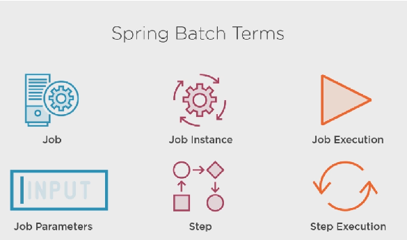
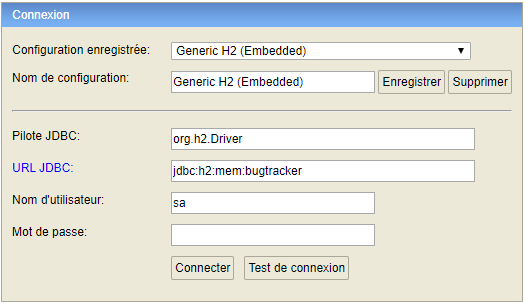
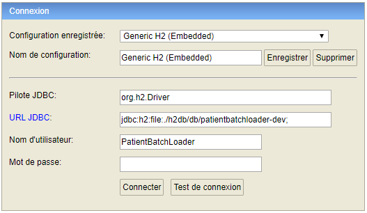

# Spring_batch

## Ajouter les dependences spring batch

Dans le fichier build.gradle ajouter les lignes suivantes:

	compile group: 'org.springframework.boot', name: 'spring-boot-starter-batch', version: '2.3.0.RELEASE'


	testCompile group: 'org.springframework.batch', name: 'spring-batch-test', version: '4.2.2.RELEASE'

## Configurer l'application Spring batch

1 . Ajouter une classe de configuration à votre projet avec les imports nécessaires, ainsi que la declaration de 3 attributs membres à la classe JobRepository, JobExplorer et JobLauncher.

```ruby
import org.springframework.batch.core.configuration.annotation.BatchConfigurer;
import org.springframework.batch.core.configuration.annotation.EnableBatchProcessing;
import org.springframework.batch.core.explore.JobExplorer;
import org.springframework.batch.core.launch.JobLauncher;
import org.springframework.batch.core.repository.JobRepository;
import org.springframework.stereotype.Component;
import org.springframework.transaction.PlatformTransactionManager;
@Component
@EnableBatchProcessing
public class BatchConfiguration implements BatchConfigurer {
	private JobRepository jobRepository;
	private JobExplorer jobExplorer;
	private JobLauncher jobLauncher;
}
```

* JobRepository: Conserve les métadonnées sur le job par lots

* JobExplorer: Recupere les métadonnées du repository

* JobLauncher: Exécute des jobs avec des paramètres donnés


2 . Cabler deux attributs membres de la classe PlatformTransactionManager et DataSource

```ruby
@Autowired
@Qualifier(value="batchTransactionManager")
private PlatformTransactionManager batchTransactionManager;
@Autowired
@Qualifier(value="bqtchDataSource")
private DataSource batchDataSource;
```

3 . Remplir le contrat d'interface de BatchConfigurer.

```ruby
@Override
public PlatformTransactionManager getTransactionManager() throws Exception {
	return this.batchTransactionManager;
}
@Override
public JobExplorer getJobExplorer() throws Exception {
	return this.jobExplorer;
}
```
	
4 . Ajouter la methode de creation d'une execution de job (launcher + repository + afterPropertiesSet)

```ruby
protected JobLauncher createJobLauncher() throws Exception {
	SimpleJobLauncher jobLauncher = new SimpleJobLauncher();
	jobLauncher.setJobRepository(jobRepository);
	jobLauncher.afterPropertiesSet();
	return jobLauncher;
}
protected JobRepository createJobRepository() throws Exception {
	JobRepositoryFactoryBean factory = new JobRepositoryFactoryBean();
	factory.setDataSource(this.batchDataSource);
	factory.setTransactionManager(getTransactionManager());
	factory.afterPropertiesSet();
	return factory.getObject();
}
@PostConstruct
public void afterPropertiesSet()throws Exception {
	this.jobRepository = createJobRepository();
	JobExplorerFactoryBean jobExplorerFactoryBean = new JobExplorerFactoryBean();
	jobExplorerFactoryBean.setDataSource(this.batchDataSource);
	jobExplorerFactoryBean.afterPropertiesSet();
	this.jobExplorer = jobExplorerFactoryBean.getObject();
	this.jobLauncher = createJobLauncher();
}
```
	
5 . Ajouter à votre fichier de configuration application.yml

	spring:
		application:
			name: PatientBatchLoader
				batch:
					job:
						enable: false
	...
	application:
		batch:
			inputPath: D:\WORK\WorkSpace\SandBox\Spring_batch\Spring_batch\data
			
6 . On ajoute dans le fichier ApplicationProperties les propriétés spécifiques à l'application

```ruby
@ConfigurationProperties(prefix = "application", ignoreUnknownFields = false)
public class ApplicationProperties {
	private final Batch batch = new Batch();
	public Batch getBatch() {
		return batch;
	}
	public static class Batch{
		private String inputPath = "D:/WORK/WorkSpace/SandBox/Spring_batch/Spring_batch/data";
		public String getInputPath() {
			return this.inputPath;
		}
		public void setInputPath(String inputPath) {
			this.inputPath = inputPath;
		}
	}	
}
```
		
## Ajout de l'objet base de donnée à Spring Batch




1 . Ajouter la ligne suivante à votre fichier master.xml
	
	<include file="config/liquibase/changelog/01012018000000_create_spring_batch_objects.xml" relativeToChangelogFile="false"/>
	
2 . Creer votre fichier 01012018000000_create_spring_batch_objects.xml

```xml
<?xml version="1.0" encoding="utf-8"?>
<databaseChangeLog
    xmlns="http://www.liquibase.org/xml/ns/dbchangelog"
    xmlns:ext="http://www.liquibase.org/xml/ns/dbchangelog-ext"
    xmlns:xsi="http://www.w3.org/2001/XMLSchema-instance"
    xsi:schemaLocation="http://www.liquibase.org/xml/ns/dbchangelog http://www.liquibase.org/xml/ns/dbchangelog/dbchangelog-3.5.xsd
                        http://www.liquibase.org/xml/ns/dbchangelog-ext http://www.liquibase.org/xml/ns/dbchangelog/dbchangelog-ext.xsd">

    <property name="now" value="now()" dbms="h2"/>
    <property name="now" value="GETDATE()" dbms="mssql"/>

    <changeSet id="01012018000001" author="system">
        <createTable tableName="BATCH_JOB_INSTANCE">
            <column name="JOB_INSTANCE_ID" type="bigint" autoIncrement="${autoIncrement}">
                <constraints primaryKey="true" nullable="false"/>
            </column>
            <column name="VERSION" type="bigint"/>
            <column name="JOB_NAME" type="VARCHAR(100)">
                <constraints nullable="false" />
            </column>
            <column name="JOB_KEY" type="VARCHAR(32)">
                <constraints nullable="false" />
            </column>
        </createTable>

        <createIndex indexName="JOB_INST_UN"
                     tableName="BATCH_JOB_INSTANCE"
                     unique="true">
            <column name="JOB_NAME" type="varchar(100)"/>
            <column name="JOB_KEY" type="varchar(32)"/>
        </createIndex>

        <createTable tableName="BATCH_JOB_EXECUTION">
            <column name="JOB_EXECUTION_ID" type="bigint" autoIncrement="${autoIncrement}">
                <constraints primaryKey="true" nullable="false"/>
            </column>
            <column name="VERSION" type="bigint"/>
            <column name="JOB_INSTANCE_ID" type="bigint">
                <constraints nullable="false" />
            </column>
            <column name="CREATE_TIME" type="timestamp">
                <constraints nullable="false" />
            </column>
            <column name="START_TIME" type="timestamp" defaultValue="null"/>
            <column name="END_TIME" type="timestamp" defaultValue="null"/>
            <column name="STATUS" type="VARCHAR(10)"/>
            <column name="EXIT_CODE" type="VARCHAR(2500)"/>
            <column name="EXIT_MESSAGE" type="VARCHAR(2500)"/>
            <column name="LAST_UPDATED" type="timestamp"/>
            <column name="JOB_CONFIGURATION_LOCATION" type="VARCHAR(2500)"/>
        </createTable>

        <addForeignKeyConstraint baseColumnNames="JOB_INSTANCE_ID"
                                 baseTableName="BATCH_JOB_EXECUTION"
                                 constraintName="JOB_INST_EXEC_FK"
                                 referencedColumnNames="JOB_INSTANCE_ID"
                                 referencedTableName="BATCH_JOB_INSTANCE"/>

        <createTable tableName="BATCH_JOB_EXECUTION_PARAMS">
            <column name="JOB_EXECUTION_ID" type="bigint" autoIncrement="${autoIncrement}">
                <constraints primaryKey="true" nullable="false"/>
            </column>
            <column name="TYPE_CD" type="VARCHAR(6)">
                <constraints nullable="false" />
            </column>
            <column name="KEY_NAME" type="VARCHAR(100)">
                <constraints nullable="false" />
            </column>
            <column name="STRING_VAL" type="VARCHAR(250)"/>
            <column name="DATE_VAL" type="timestamp" defaultValue="null"/>
            <column name="LONG_VAL" type="bigint"/>
            <column name="DOUBLE_VAL" type="double precision"/>
            <column name="IDENTIFYING" type="CHAR(1)">
                <constraints nullable="false" />
            </column>
        </createTable>

        <addForeignKeyConstraint baseColumnNames="JOB_EXECUTION_ID"
                                 baseTableName="BATCH_JOB_EXECUTION_PARAMS"
                                 constraintName="JOB_EXEC_PARAMS_FK"
                                 referencedColumnNames="JOB_EXECUTION_ID"
                                 referencedTableName="BATCH_JOB_EXECUTION"/>

        <createTable tableName="BATCH_STEP_EXECUTION">
            <column name="STEP_EXECUTION_ID" type="bigint" autoIncrement="${autoIncrement}">
                <constraints primaryKey="true" nullable="false"/>
            </column>
            <column name="VERSION" type="bigint">
                <constraints nullable="false" />
            </column>
            <column name="STEP_NAME" type="varchar(100)">
                <constraints nullable="false" />
            </column>
            <column name="JOB_EXECUTION_ID" type="bigint">
                <constraints nullable="false" />
            </column>
            <column name="START_TIME" type="timestamp">
                <constraints nullable="false" />
            </column>
            <column name="END_TIME" type="timestamp" defaultValue="null"/>
            <column name="STATUS" type="varchar(10)"/>
            <column name="COMMIT_COUNT" type="bigint"/>
            <column name="READ_COUNT" type="bigint"/>
            <column name="FILTER_COUNT" type="bigint"/>
            <column name="WRITE_COUNT" type="bigint"/>
            <column name="READ_SKIP_COUNT" type="bigint"/>
            <column name="WRITE_SKIP_COUNT" type="bigint"/>
            <column name="PROCESS_SKIP_COUNT" type="bigint"/>
            <column name="ROLLBACK_COUNT" type="bigint"/>
            <column name="EXIT_CODE" type="varchar(2500)"/>
            <column name="EXIT_MESSAGE" type="varchar(2500)"/>
            <column name="LAST_UPDATED" type="timestamp"/>
        </createTable>

        <addForeignKeyConstraint baseColumnNames="JOB_EXECUTION_ID"
                                 baseTableName="BATCH_STEP_EXECUTION"
                                 constraintName="JOB_EXEC_STEP_FK"
                                 referencedColumnNames="JOB_EXECUTION_ID"
                                 referencedTableName="BATCH_JOB_EXECUTION"/>

        <createTable tableName="BATCH_STEP_EXECUTION_CONTEXT">
            <column name="STEP_EXECUTION_ID" type="bigint" autoIncrement="${autoIncrement}">
                <constraints primaryKey="true" nullable="false"/>
            </column>
            <column name="SHORT_CONTEXT" type="varchar(2500)">
                <constraints nullable="false" />
            </column>
            <column name="SERIALIZED_CONTEXT" type="LONGVARCHAR"/>
        </createTable>

        <addForeignKeyConstraint baseColumnNames="STEP_EXECUTION_ID"
                                 baseTableName="BATCH_STEP_EXECUTION_CONTEXT"
                                 constraintName="STEP_EXEC_CTX_FK"
                                 referencedColumnNames="STEP_EXECUTION_ID"
                                 referencedTableName="BATCH_STEP_EXECUTION"/>

        <createTable tableName="BATCH_JOB_EXECUTION_CONTEXT">
            <column name="JOB_EXECUTION_ID" type="bigint" autoIncrement="${autoIncrement}">
                <constraints primaryKey="true" nullable="false"/>
            </column>
            <column name="SHORT_CONTEXT" type="varchar(2500)">
                <constraints nullable="false" />
            </column>
            <column name="SERIALIZED_CONTEXT" type="LONGVARCHAR"/>
        </createTable>

        <addForeignKeyConstraint baseColumnNames="JOB_EXECUTION_ID"
                                 baseTableName="BATCH_JOB_EXECUTION_CONTEXT"
                                 constraintName="JOB_EXEC_CTX_FK"
                                 referencedColumnNames="JOB_EXECUTION_ID"
                                 referencedTableName="BATCH_JOB_EXECUTION"/>

        <createSequence sequenceName="BATCH_STEP_EXECUTION_SEQ" />
        <createSequence sequenceName="BATCH_JOB_EXECUTION_SEQ" />
        <createSequence sequenceName="BATCH_JOB_SEQ" />

    </changeSet>
</databaseChangeLog>
```

3 . Executer votre application avec spring PatientBatchLoaderApp

4 . Controler votre base de donnée à l'adresse url:

http://localhost:8080/console

5 . Changer les proprietes de configuration du serveur H2 tel quel:

Avant:



Apres:




Méfiance il y a un point qui traine dans le chemin

## Configuration du job de Spring Batch

1 . Creer une classe BatchJobConfiguration dans le package config avec:
* la creation d'un bean JobRegistryBeanPostProcessor
* la creation d'un bean Job

2 . Ajouter les constantes dans le fichier Constants

	public static final String JOB_NAME = "patient-batch-loader";
	
3 . Creer un bean sur la methode de validation dans la classe BatchJobConfiguration (nous validerons ici que le fichier est present et que le fichier de destination exist.

```ruby
package com.pluralsight.springbatch.patientbatchloader.config;
import java.io.File;
import java.nio.file.Files;
import java.nio.file.Path;
import java.nio.file.Paths;
import org.apache.commons.lang3.StringUtils;
import org.springframework.batch.core.Job;
import org.springframework.batch.core.JobParameters;
import org.springframework.batch.core.JobParametersInvalidException;
import org.springframework.batch.core.JobParametersValidator;
import org.springframework.batch.core.Step;
import org.springframework.batch.core.configuration.JobRegistry;
import org.springframework.batch.core.configuration.annotation.JobBuilderFactory;
import org.springframework.batch.core.configuration.support.JobRegistryBeanPostProcessor;
import org.springframework.beans.factory.annotation.Autowired;
import org.springframework.context.annotation.Bean;
import org.springframework.context.annotation.Configuration;

@Configuration
public class BatchJobConfiguration {
	@Autowired
	private JobBuilderFactory jobBuilderFactory;
	@Autowired
	private ApplicationProperties applicationProperties;
	@Bean
	JobRegistryBeanPostProcessor jobRegistryBeanPostProcessor(JobRegistry jobRegistry) {
		JobRegistryBeanPostProcessor postProcessor = new JobRegistryBeanPostProcessor();
		postProcessor.setJobRegistry(jobRegistry);
		return postProcessor;
	}
	@Bean
	Job job(Step step) throws Exception {
		return this.jobBuilderFactory.get(Constants.JOB_NAME).validator(validator()).start(step).build();
	}
	@Bean
	public JobParametersValidator validator() {
		return new JobParametersValidator() {
			@Override
			public void validate(JobParameters parameters) throws JobParametersInvalidException {
				String fileName = parameters.getString(Constants.JOB_PARAM_FILE_NAME);
				if (StringUtils.isBlank(fileName)) {
					throw new JobParametersInvalidException("Le parametre de patient-batch-loader.fileName est requis");
				}
				try {
					Path file = Paths.get(applicationProperties.getBatch().getInputPath() + File.separator + fileName);
					if (Files.notExists(file) || !Files.isReadable(file)) {
						throw new Exception("Le fichier n'existe pas ou n'est pas lisable");
					}
				} catch (Exception e) {
					throw new JobParametersInvalidException(
							"le paramètre chemin d'accès + patient-batch-loader.filename doit être un emplacement de fichier valide");
				}
			}
		};
	}
}

```

## Configuration d'un step de Spring Batch


1 . Creer attribut stepBuilderFactory membre de la classe StepBuilderFactory et un Bean sur la methode step() du fichier BatchJobConfiguration

```ruby
@Autowired
private StepBuilderFactory stepBuilderFactory;
@Bean
public Step step(ItemReader<PatientRecord> itemReader) throws Exception {
    return this.stepBuilderFactory
        .get(Constants.STEP_NAME)
        .<PatientRecord, PatientRecord>chunk(2)
        .reader(itemReader)
        .processor(processor())
        .writer(writer())
        .build();
}
```

## Creation de test

Nous allons tester que le job est disponible dans le context Spring avec le bon nom.

1 . Creation d'une classe test BatchJobConfigurationTest

```ruby
@RunWith(SpringRunner.class)
@SpringBootTest(classes = PatientBatchLoaderApp.class)
@ActiveProfiles("dev")
public class BatchJobConfigurationTest {
	@Autowired
	private Job job;
	@Test
	public void test() {
		assertNotNull(job);
		assertEquals(Constants.JOB_NAME, job.getName());
	}
}
```

## Launching a job, Spring batch job execution

1 . Creer une class JobResource dans le package web.rest

```ruby
@RestController
@RequestMapping("/job")
public class JobResource {

	private final JobLauncher jobLauncher;
	private final Job job;

	public JobResource(JobLauncher jobLauncher, Job job) {
		super();
		this.jobLauncher = jobLauncher;
		this.job = job;
	}

	@GetMapping("/{fileName:.+}")
	public ResponseEntity<String> runJob(@PathVariable String fileName) {
		Map<String, JobParameter> parameterMap = new HashMap<>();
		parameterMap.put(Constants.JOB_PARAM_FILE_NAME, new JobParameter(fileName));
		try {
			jobLauncher.run(job, new JobParameters(parameterMap));
		} catch (Exception e) {
			return new ResponseEntity<String>("Failure" + e.getMessage(), HttpStatus.INTERNAL_SERVER_ERROR);
		}
		return new ResponseEntity<String>("Success", HttpStatus.OK);
	}
}
```


