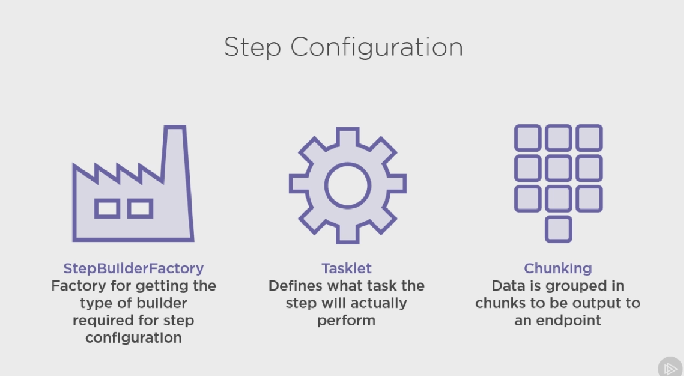

# Spring_batch

**Ne jamais oublier** que pendant l'execution d'un projet Spring nous pouvons controler son etats de santé avec localhost:8080/actuator.

Avec SOAPUI par exemple.

Voir:

https://docs.spring.io/spring-boot/docs/current/reference/html/production-ready-features.html


## Ajouter les dependences spring batch

Dans le fichier build.gradle ajouter les lignes suivantes:

	compile group: 'org.springframework.boot', name: 'spring-boot-starter-batch', version: '2.3.0.RELEASE'


	testCompile group: 'org.springframework.batch', name: 'spring-batch-test', version: '4.2.2.RELEASE'

## Configurer l'application Spring batch

1 . Ajouter une classe de configuration à votre projet avec les imports nécessaires, ainsi que la declaration de 3 attributs membres à la classe JobRepository, JobExplorer et JobLauncher.

```ruby

@Component
@EnableBatchProcessing
public class BatchConfiguration implements BatchConfigurer {
	private JobRepository jobRepository;
	private JobExplorer jobExplorer;
	private JobLauncher jobLauncher;
}
```

* JobRepository: Conserve les métadonnées sur le job par lots

* JobExplorer: Recupere les métadonnées du repository

* JobLauncher: Exécute des jobs avec des paramètres donnés


2 . Cabler deux attributs membres de la classe PlatformTransactionManager et DataSource

```ruby
@Autowired
@Qualifier(value="batchTransactionManager")
private PlatformTransactionManager batchTransactionManager;
@Autowired
@Qualifier(value="batchDataSource")
private DataSource batchDataSource;
```

3 . Remplir le contrat d'interface de BatchConfigurer.

```ruby
...
	@Override
	public JobRepository getJobRepository() throws Exception {
		return this.jobRepository;
	}
	@Override
	public JobExplorer getJobExplorer() throws Exception {
		return this.jobExplorer;
	}
	@Override
	public JobLauncher getJobLauncher() throws Exception {
		return this.jobLauncher;
	}
	@Override
	public PlatformTransactionManager getTransactionManager() throws Exception {
		return this.batchTransactionManager;
	}
```
	
4 . Ajouter la methode de creation d'une execution de job (launcher + repository + afterPropertiesSet)

```ruby
protected JobLauncher createJobLauncher() throws Exception {
	SimpleJobLauncher jobLauncher = new SimpleJobLauncher();
	jobLauncher.setJobRepository(jobRepository);
	jobLauncher.afterPropertiesSet();
	return jobLauncher;
}
protected JobRepository createJobRepository() throws Exception {
	JobRepositoryFactoryBean factory = new JobRepositoryFactoryBean();
	factory.setDataSource(this.batchDataSource);
	factory.setTransactionManager(getTransactionManager());
	factory.afterPropertiesSet();
	return factory.getObject();
}
@PostConstruct
public void afterPropertiesSet()throws Exception {
	this.jobRepository = createJobRepository();
	JobExplorerFactoryBean jobExplorerFactoryBean = new JobExplorerFactoryBean();
	jobExplorerFactoryBean.setDataSource(this.batchDataSource);
	jobExplorerFactoryBean.afterPropertiesSet();
	this.jobExplorer = jobExplorerFactoryBean.getObject();
	this.jobLauncher = createJobLauncher();
}
```
	
5 . Ajouter à votre fichier de configuration application.yml

	spring:
		application:
			name: PatientBatchLoader
				batch:
					job:
						enable: false
	...
	application:
		batch:
			inputPath: D:\WORK\WorkSpace\SandBox\Spring_batch\Spring_batch\data
			
6 . On ajoute dans le fichier ApplicationProperties les propriétés spécifiques à l'application

```ruby
@ConfigurationProperties(prefix = "application", ignoreUnknownFields = false)
public class ApplicationProperties {
	private final Batch batch = new Batch();
	public Batch getBatch() {
		return batch;
	}
	public static class Batch{
		private String inputPath = "D:/WORK/WorkSpace/SandBox/Spring_batch/Spring_batch/data";
		public String getInputPath() {
			return this.inputPath;
		}
		public void setInputPath(String inputPath) {
			this.inputPath = inputPath;
		}
	}	
}
```
		
## Ajout de l'objet base de donnée à Spring Batch


1 . Ajouter la ligne suivante à votre fichier master.xml
	
	<include file="config/liquibase/changelog/01012018000000_create_spring_batch_objects.xml" relativeToChangelogFile="false"/>
	
2 . Creer votre fichier 01012018000000_create_spring_batch_objects.xml

```xml
<?xml version="1.0" encoding="utf-8"?>
<databaseChangeLog
    xmlns="http://www.liquibase.org/xml/ns/dbchangelog"
    xmlns:ext="http://www.liquibase.org/xml/ns/dbchangelog-ext"
    xmlns:xsi="http://www.w3.org/2001/XMLSchema-instance"
    xsi:schemaLocation="http://www.liquibase.org/xml/ns/dbchangelog http://www.liquibase.org/xml/ns/dbchangelog/dbchangelog-3.5.xsd
                        http://www.liquibase.org/xml/ns/dbchangelog-ext http://www.liquibase.org/xml/ns/dbchangelog/dbchangelog-ext.xsd">

    <property name="now" value="now()" dbms="h2"/>
    <property name="now" value="GETDATE()" dbms="mssql"/>

    <changeSet id="01012018000001" author="system">
        <createTable tableName="BATCH_JOB_INSTANCE">
            <column name="JOB_INSTANCE_ID" type="bigint" autoIncrement="${autoIncrement}">
                <constraints primaryKey="true" nullable="false"/>
            </column>
            <column name="VERSION" type="bigint"/>
            <column name="JOB_NAME" type="VARCHAR(100)">
                <constraints nullable="false" />
            </column>
            <column name="JOB_KEY" type="VARCHAR(32)">
                <constraints nullable="false" />
            </column>
        </createTable>

        <createIndex indexName="JOB_INST_UN"
                     tableName="BATCH_JOB_INSTANCE"
                     unique="true">
            <column name="JOB_NAME" type="varchar(100)"/>
            <column name="JOB_KEY" type="varchar(32)"/>
        </createIndex>

        <createTable tableName="BATCH_JOB_EXECUTION">
            <column name="JOB_EXECUTION_ID" type="bigint" autoIncrement="${autoIncrement}">
                <constraints primaryKey="true" nullable="false"/>
            </column>
            <column name="VERSION" type="bigint"/>
            <column name="JOB_INSTANCE_ID" type="bigint">
                <constraints nullable="false" />
            </column>
            <column name="CREATE_TIME" type="timestamp">
                <constraints nullable="false" />
            </column>
            <column name="START_TIME" type="timestamp" defaultValue="null"/>
            <column name="END_TIME" type="timestamp" defaultValue="null"/>
            <column name="STATUS" type="VARCHAR(10)"/>
            <column name="EXIT_CODE" type="VARCHAR(2500)"/>
            <column name="EXIT_MESSAGE" type="VARCHAR(2500)"/>
            <column name="LAST_UPDATED" type="timestamp"/>
            <column name="JOB_CONFIGURATION_LOCATION" type="VARCHAR(2500)"/>
        </createTable>

        <addForeignKeyConstraint baseColumnNames="JOB_INSTANCE_ID"
                                 baseTableName="BATCH_JOB_EXECUTION"
                                 constraintName="JOB_INST_EXEC_FK"
                                 referencedColumnNames="JOB_INSTANCE_ID"
                                 referencedTableName="BATCH_JOB_INSTANCE"/>

        <createTable tableName="BATCH_JOB_EXECUTION_PARAMS">
            <column name="JOB_EXECUTION_ID" type="bigint" autoIncrement="${autoIncrement}">
                <constraints primaryKey="true" nullable="false"/>
            </column>
            <column name="TYPE_CD" type="VARCHAR(6)">
                <constraints nullable="false" />
            </column>
            <column name="KEY_NAME" type="VARCHAR(100)">
                <constraints nullable="false" />
            </column>
            <column name="STRING_VAL" type="VARCHAR(250)"/>
            <column name="DATE_VAL" type="timestamp" defaultValue="null"/>
            <column name="LONG_VAL" type="bigint"/>
            <column name="DOUBLE_VAL" type="double precision"/>
            <column name="IDENTIFYING" type="CHAR(1)">
                <constraints nullable="false" />
            </column>
        </createTable>

        <addForeignKeyConstraint baseColumnNames="JOB_EXECUTION_ID"
                                 baseTableName="BATCH_JOB_EXECUTION_PARAMS"
                                 constraintName="JOB_EXEC_PARAMS_FK"
                                 referencedColumnNames="JOB_EXECUTION_ID"
                                 referencedTableName="BATCH_JOB_EXECUTION"/>

        <createTable tableName="BATCH_STEP_EXECUTION">
            <column name="STEP_EXECUTION_ID" type="bigint" autoIncrement="${autoIncrement}">
                <constraints primaryKey="true" nullable="false"/>
            </column>
            <column name="VERSION" type="bigint">
                <constraints nullable="false" />
            </column>
            <column name="STEP_NAME" type="varchar(100)">
                <constraints nullable="false" />
            </column>
            <column name="JOB_EXECUTION_ID" type="bigint">
                <constraints nullable="false" />
            </column>
            <column name="START_TIME" type="timestamp">
                <constraints nullable="false" />
            </column>
            <column name="END_TIME" type="timestamp" defaultValue="null"/>
            <column name="STATUS" type="varchar(10)"/>
            <column name="COMMIT_COUNT" type="bigint"/>
            <column name="READ_COUNT" type="bigint"/>
            <column name="FILTER_COUNT" type="bigint"/>
            <column name="WRITE_COUNT" type="bigint"/>
            <column name="READ_SKIP_COUNT" type="bigint"/>
            <column name="WRITE_SKIP_COUNT" type="bigint"/>
            <column name="PROCESS_SKIP_COUNT" type="bigint"/>
            <column name="ROLLBACK_COUNT" type="bigint"/>
            <column name="EXIT_CODE" type="varchar(2500)"/>
            <column name="EXIT_MESSAGE" type="varchar(2500)"/>
            <column name="LAST_UPDATED" type="timestamp"/>
        </createTable>

        <addForeignKeyConstraint baseColumnNames="JOB_EXECUTION_ID"
                                 baseTableName="BATCH_STEP_EXECUTION"
                                 constraintName="JOB_EXEC_STEP_FK"
                                 referencedColumnNames="JOB_EXECUTION_ID"
                                 referencedTableName="BATCH_JOB_EXECUTION"/>

        <createTable tableName="BATCH_STEP_EXECUTION_CONTEXT">
            <column name="STEP_EXECUTION_ID" type="bigint" autoIncrement="${autoIncrement}">
                <constraints primaryKey="true" nullable="false"/>
            </column>
            <column name="SHORT_CONTEXT" type="varchar(2500)">
                <constraints nullable="false" />
            </column>
            <column name="SERIALIZED_CONTEXT" type="LONGVARCHAR"/>
        </createTable>

        <addForeignKeyConstraint baseColumnNames="STEP_EXECUTION_ID"
                                 baseTableName="BATCH_STEP_EXECUTION_CONTEXT"
                                 constraintName="STEP_EXEC_CTX_FK"
                                 referencedColumnNames="STEP_EXECUTION_ID"
                                 referencedTableName="BATCH_STEP_EXECUTION"/>

        <createTable tableName="BATCH_JOB_EXECUTION_CONTEXT">
            <column name="JOB_EXECUTION_ID" type="bigint" autoIncrement="${autoIncrement}">
                <constraints primaryKey="true" nullable="false"/>
            </column>
            <column name="SHORT_CONTEXT" type="varchar(2500)">
                <constraints nullable="false" />
            </column>
            <column name="SERIALIZED_CONTEXT" type="LONGVARCHAR"/>
        </createTable>

        <addForeignKeyConstraint baseColumnNames="JOB_EXECUTION_ID"
                                 baseTableName="BATCH_JOB_EXECUTION_CONTEXT"
                                 constraintName="JOB_EXEC_CTX_FK"
                                 referencedColumnNames="JOB_EXECUTION_ID"
                                 referencedTableName="BATCH_JOB_EXECUTION"/>

        <createSequence sequenceName="BATCH_STEP_EXECUTION_SEQ" />
        <createSequence sequenceName="BATCH_JOB_EXECUTION_SEQ" />
        <createSequence sequenceName="BATCH_JOB_SEQ" />

    </changeSet>
</databaseChangeLog>
```

3 . Executer votre application avec spring PatientBatchLoaderApp

4 . Controler votre base de donnée à l'adresse url:

http://localhost:8080/console

5 . Changer les proprietes de configuration du serveur H2 tel quel:

Avant:


Apres:


Méfiance il y a un point qui traine dans le chemin

## Configuration du job de Spring Batch

1 . Creer une classe BatchJobConfiguration dans le package config avec:
* la creation d'un bean JobRegistryBeanPostProcessor
* la creation d'un bean Job

2 . Ajouter les constantes dans le fichier Constants

	public static final String JOB_NAME = "patient-batch-loader";
	
3 . Creer un bean sur la methode de validation dans la classe BatchJobConfiguration (nous validerons ici que le fichier est present et que le fichier de destination exist.

```ruby
package com.pluralsight.springbatch.patientbatchloader.config;
import java.io.File;
import java.nio.file.Files;
import java.nio.file.Path;
import java.nio.file.Paths;
import org.apache.commons.lang3.StringUtils;
import org.springframework.batch.core.Job;
import org.springframework.batch.core.JobParameters;
import org.springframework.batch.core.JobParametersInvalidException;
import org.springframework.batch.core.JobParametersValidator;
import org.springframework.batch.core.Step;
import org.springframework.batch.core.configuration.JobRegistry;
import org.springframework.batch.core.configuration.annotation.JobBuilderFactory;
import org.springframework.batch.core.configuration.support.JobRegistryBeanPostProcessor;
import org.springframework.beans.factory.annotation.Autowired;
import org.springframework.context.annotation.Bean;
import org.springframework.context.annotation.Configuration;

@Configuration
public class BatchJobConfiguration {
	@Autowired
	private JobBuilderFactory jobBuilderFactory;
	@Autowired
	private ApplicationProperties applicationProperties;
	@Bean
	JobRegistryBeanPostProcessor jobRegistryBeanPostProcessor(JobRegistry jobRegistry) {
		JobRegistryBeanPostProcessor postProcessor = new JobRegistryBeanPostProcessor();
		postProcessor.setJobRegistry(jobRegistry);
		return postProcessor;
	}
	@Bean
	Job job(Step step) throws Exception {
		return this.jobBuilderFactory.get(Constants.JOB_NAME).validator(validator()).start(step).build();
	}
	@Bean
	public JobParametersValidator validator() {
		return new JobParametersValidator() {
			@Override
			public void validate(JobParameters parameters) throws JobParametersInvalidException {
				String fileName = parameters.getString(Constants.JOB_PARAM_FILE_NAME);
				if (StringUtils.isBlank(fileName)) {
					throw new JobParametersInvalidException("Le parametre de patient-batch-loader.fileName est requis");
				}
				try {
					Path file = Paths.get(applicationProperties.getBatch().getInputPath() + File.separator + fileName);
					if (Files.notExists(file) || !Files.isReadable(file)) {
						throw new Exception("Le fichier n'existe pas ou n'est pas lisable");
					}
				} catch (Exception e) {
					throw new JobParametersInvalidException(
							"le paramètre chemin d'accès + patient-batch-loader.filename doit être un emplacement de fichier valide");
				}
			}
		};
	}
}

```

## Configuration d'un step de Spring Batch



1 . Creer attribut stepBuilderFactory membre de la classe StepBuilderFactory et un Bean sur la methode step() du fichier BatchJobConfiguration

```ruby
@Autowired
private StepBuilderFactory stepBuilderFactory;
@Bean
public Step step(ItemReader<PatientRecord> itemReader) throws Exception {
    return this.stepBuilderFactory
        .get(Constants.STEP_NAME)
        .<PatientRecord, PatientRecord>chunk(2)
        .reader(itemReader)
        .processor(processor())
        .writer(writer())
        .build();
}
```

## Creation de test

Nous allons tester que le job est disponible dans le context Spring avec le bon nom.

1 . Creation d'une classe test BatchJobConfigurationTest

```ruby
@RunWith(SpringRunner.class)
@SpringBootTest(classes = PatientBatchLoaderApp.class)
@ActiveProfiles("dev")
public class BatchJobConfigurationTest {
	@Autowired
	private Job job;
	@Test
	public void test() {
		assertNotNull(job);
		assertEquals(Constants.JOB_NAME, job.getName());
	}
}
```

## Launching a job, Spring batch job execution

1 . Creer une class JobResource dans le package web.rest

```ruby
@RestController
@RequestMapping("/job")
public class JobResource {

	private final JobLauncher jobLauncher;
	private final Job job;

	public JobResource(JobLauncher jobLauncher, Job job) {
		super();
		this.jobLauncher = jobLauncher;
		this.job = job;
	}

	@GetMapping("/{fileName:.+}")
	public ResponseEntity<String> runJob(@PathVariable String fileName) {
		Map<String, JobParameter> parameterMap = new HashMap<>();
		parameterMap.put(Constants.JOB_PARAM_FILE_NAME, new JobParameter(fileName));
		try {
			jobLauncher.run(job, new JobParameters(parameterMap));
		} catch (Exception e) {
			return new ResponseEntity<String>("Failure" + e.getMessage(), HttpStatus.INTERNAL_SERVER_ERROR);
		}
		return new ResponseEntity<String>("Success", HttpStatus.OK);
	}
}
```

Tester le lancement du job en executant l'application puis à l'aide de SoapUI envoyer une requete à l'adresse:

http://localhost:8080/job/test-unit-testing.csv

Le resultat se trouvera dans la console:

	Hello World!!

## Consommation d'un fichier d'entrée (consuming an input file)

Rappel serialisation/deserialisation

http://blog.paumard.org/cours/java/chap10-entrees-sorties-serialization.html

Notre fichier d'entrée sera un fichier .csv celui-ci devra etre avoir la structure suivante:

* Avoir un delimiteur de champs, ici : ",".
* Avoir une entete, ici le nom des champs de colonne.
* Avoir les champs/ valeur qui seraient requis et compris par le provider et consumer


Exemple entête:


```csv
source_id,first_name,middle_initial,last_name,email_address,phone_number,street,city,state,zip,birthdate,action,ssn
```
Suivi des datas attendues par le providers et consumer:

```csv
72739d22-3c12-539b-b3c2-13d9d4224d40,Hettie,P,Schmidt,rodo@uge.li,(805) 384-3727,Hutij Terrace,Kahgepu,ID,40239,6/14/1961,I,071-81-2500
```

1 . Creation de la classe PatientRecord qui sera serialisable (implements Serializable) avec des attributs representant l'entete du fichier csv que l'on typera en String. Puis génération getters/setters et constructeurs sans et avec constructeur + Override toString().


Exemple:

```java
public class PatientRecord  implements Serializable{
	private static final long serialVersionUID = -6177158019126398888L;
	
	private String sourceId;
	private String firstName;
	...
	
	public PatientRecord(String sourceId, String firstName, ...) {
		super();
		this.sourceId = sourceId;
		this.firstName = firstName;
		...
	}

	public PatientRecord() {
		super();
	}

...

	public String getSource_id() {
		return sourceId;
	}

	public void setSource_id(String sourceId) {
		this.sourceId = sourceId;
	}
	...
	@Override
	public String toString() {
		return "PatientRecord{" + "sourceId='" + sourceId + '\'' + ", firstName='" + firstName + '\''
				+ ...
	}
}

```

2 . Mise à jour de notre step pour regroupement

Lors de l'execution de notre job notre step (BatchJobConfiguration.java) nous retourne uniquement "Hello world" a l'aide de talkLet.

Nous allons remplacer le talklet par un traitement par lot (chunk-oriented processing), utilisant un ItemReader en parametre du step

Les implémentations ItemReader doivent être avec état et seront appelées plusieurs fois pour chaque lot, chaque appel read() renvoyant une valeur différente et retournera finalement null lorsque toutes les données d'entrée seront épuisées.
Les implémentations n'ont pas besoin d'être thread-safe et les clients ItemReader doivent savoir que c'est le cas.


Remplacer la methode step par :

```ruby
@Bean
public Step step(ItemReader<PatientRecord> itemReader) throws Exception {
	return this.stepBuilderFactory
			.get(Constants.STEP_NAME)
			.<PatientRecord, PatientRecord>chunk(2)
			.reader(itemReader)
			.processor(processor())
			.writer(writer)
			.build();		
}
```

3 . Implementer générateur de lecteur d'élément de fichier plat (FlatFile ItemReader Builder) nous allons :

* Ouvrir le fichier
* Sauter la  premier ligne
* lire chaque ligne contenu
* cartogrraphier chaque data pour la classe PatientRecord

La classe Spring FlatFileItemReader realise cela pour nous à l'aide de LinMapper.

Exemple FlatFileItemReader :

```ruby
@Bean
@StepScope
public FlatFileItemReader<PatientRecord> reader(@Value("#{jobParameters['" + Constants.JOB_PARAM_FILE_NAME + "']}") String fileName) {
	return new FlatFileItemReaderBuilder<PatientRecord>()
			.name(Constants.ITEM_READER_NAME)
			.resource(new PathResource(Paths.get(applicationProperties.getBatch().getInputPath() + File.separator + fileName)))
			.linesToSkip(1).lineMapper(lineMapper()).build();
}
```

	
Exemple de LineMapper

```ruby
@Bean
public LineMapper<PatientRecord> lineMapper() {
	DefaultLineMapper<PatientRecord> mapper = new DefaultLineMapper<>();
	mapper.setFieldSetMapper((fieldSet)->new PatientRecord(
			fieldSet.readString(0), fieldSet.readString(1),
			fieldSet.readString(2), fieldSet.readString(3),
			fieldSet.readString(4), fieldSet.readString(5),
			fieldSet.readString(6), fieldSet.readString(7),
			fieldSet.readString(8), fieldSet.readString(9),
			fieldSet.readString(10), fieldSet.readString(11),
			fieldSet.readString(12)));
	mapper.setLineTokenizer(new DelimitedLineTokenizer());
	return mapper;
}
```

4 . Creation des methodes de processor() et writer() issu de Spring ItemWriter et de Spring PassThroughItemProcessor

PassThroughItemProcessor:

transmet simplement son argument à l'appelant. Utile par défaut lorsque le lecteur et le rédacteur d'un processus métier traitent des éléments du même type et qu'aucune transformation n'est requise

Dans BatchJobConfiguration:

```ruby
@Bean
	@StepScope
	public PassThroughItemProcessor<PatientRecord> processor(){
		return new PassThroughItemProcessor<>();
	}
@Bean
@StepScope
public ItemWriter<PatientRecord> writer(){
	return new ItemWriter<PatientRecord>() {
		@Override
		public void write(List<? extends PatientRecord> items) throws Exception {
			for (PatientRecord patientRecord : items) {
				System.err.println("Ecriture item : " + patientRecord.toString());
			}
		}
	};
}
```

5 . Test

```ruby
	@Autowired
	private FlatFileItemReader<PatientRecord> reader;
	private JobParameters jobParameters;
	@Before
	public void setUpt() {
		Map<String, JobParameter> params = new HashMap<>();
		params.put(Constants.JOB_PARAM_FILE_NAME, new JobParameter("test-unit-testing.csv"));
		jobParameters = new JobParameters(params);
	}

    @Test
    public void testReader() throws Exception {
        StepExecution stepExecution = MetaDataInstanceFactory.createStepExecution(jobParameters);
        int count = 0;
        try {
            count = StepScopeTestUtils.doInStepScope(stepExecution, () -> {
                int numPatients = 0;
                PatientRecord patient;
                try {
                    reader.open(stepExecution.getExecutionContext());
                    while ((patient = reader.read()) != null) {
                        assertNotNull(patient);
                        assertEquals("72739d22-3c12-539b-b3c2-13d9d4224d40", patient.getSourceId());
                        assertEquals("Hettie", patient.getFirstName());
                        assertEquals("P", patient.getMiddleInitial());
                        assertEquals("Schmidt", patient.getLastName());
                        assertEquals("rodo@uge.li", patient.getEmailAddress());
                        assertEquals("(805) 384-3727", patient.getPhoneNumber());
                        assertEquals("Hutij Terrace", patient.getStreet());
                        assertEquals("Kahgepu", patient.getCity());
                        assertEquals("ID", patient.getState());
                        assertEquals("40239", patient.getZip());
                        assertEquals("6/14/1961", patient.getBirthDate());
                        assertEquals("I", patient.getAction());
                        assertEquals("071-81-2500", patient.getSsn());
                        numPatients++;
                    }
                } finally {
                    try { reader.close(); } catch (Exception e) { fail(e.toString()); }
                }
                return numPatients;
            });
        } catch (Exception e) {
            fail(e.toString());
        }
        assertEquals(1, count);
    }
}
```

Executer l'executio ndu test pour le valider.

## Traitement des data d'entrée (Processing Input Data)

1 . Creation de la class PatientEntity

Simple Pojo ayant les attribut de l'entete du fichier Csv + id. Ajouter les annotation JPA pour la construction des table et colonne. Ajouter un constructeur avec tous les attributs et un sans l'attribut id. Generer getter, setter et un toString.

2 . Implementer un processeur d'element (item processor).

On remplace la methode processor() :

```ruby
@Bean
@StepScope
public Function<PatientRecord, PatientEntity> processor() {
	return (patientRecord) -> {
		return new PatientEntity(patientRecord.getSourceId(), 
				patientRecord.getFirstName(),
				patientRecord.getMiddleInitial(),
				patientRecord.getLastName(),
				patientRecord.getEmailAddress(),
				patientRecord.getPhoneNumber(),
				patientRecord.getStreet(),
				patientRecord.getCity(),
				patientRecord.getState(),
				patientRecord.getZip(),
				LocalDate.parse(patientRecord.getBirthDate(),
				DateTimeFormatter.ofPattern("M/dd/yyyy")),
				patientRecord.getSsn());
	};
}
```

On remplace la methode step():

```ruby
@Bean
public Step step(ItemReader<PatientRecord> itemReader, Function<PatientRecord, PatientEntity> processor)
		throws Exception {
	return this.stepBuilderFactory.get(Constants.STEP_NAME).<PatientRecord, PatientEntity>chunk(2)
			.reader(itemReader).processor(processor).writer(writer()).build();
}
```

On remplace la methode writer():

```ruby
@Bean
@StepScope
public ItemWriter<PatientEntity> writer() {
	return new ItemWriter<PatientEntity>() {
		@Override
		public void write(List<? extends PatientEntity> items) throws Exception {
			for (PatientEntity patientEntity : items) {
				System.err.println("Ecriture iotem : " + patientEntity.toString());
			}
		}
	};
}
```

3 . Test Procesor

On ajoute l'annotation @TestExecutionListener sur la classe test (BatchJobConfigurationTest)

TestExecutionListener: définit une API d'écoute pour réagir aux événements d'exécution de test publiés par TestContextManageravec lesquels l'écoute est enregistré.


```ruby
@Autowired
private Function<PatientRecord, PatientEntity> processor;

@Test
public void testProcessor() throws Exception {
    PatientRecord patientRecord = new PatientRecord(
            "72739d22-3c12-539b-b3c2-13d9d4224d40",
            "Hettie",
            "P",
            "Schmidt",
            "rodo@uge.li",
            "(805) 384-3727",
            "Hutij Terrace",
            "Kahgepu",
            "ID",
            "40239",
            "6/14/1961",
            "I",
            "071-81-2500");
        PatientEntity entity = processor.apply(patientRecord);
        assertNotNull(entity);
        assertEquals("72739d22-3c12-539b-b3c2-13d9d4224d40", entity.getSourceId());
        assertEquals("Hettie", entity.getFirstName());
        assertEquals("P", entity.getMiddleInitial());
        assertEquals("Schmidt", entity.getLastName());
        assertEquals("rodo@uge.li", entity.getEmailAddress());
        assertEquals("(805) 384-3727", entity.getPhoneNumber());
        assertEquals("Hutij Terrace", entity.getStreet());
        assertEquals("Kahgepu", entity.getCity());
        assertEquals("ID", entity.getState());
        assertEquals("40239", entity.getZipCode());
        assertEquals(14, entity.getBirthDate().getDayOfMonth());
        assertEquals(6, entity.getBirthDate().getMonthValue());
        assertEquals(1961, entity.getBirthDate().getYear());
        assertEquals("071-81-2500", entity.getSocialSecurityNumber());
    }
...
```

Et on test.


## Bug fix

Erreur lors du test() me retourne "Le parametre de patient-batch-loader.fileName est requis"

Issu de:

```ruby
if (StringUtils.isBlank(fileName)) {
					throw new JobParametersInvalidException("Le parametre de patient-batch-loader.fileName est requis");
				}
```

Resolution:

Probleme sur l'indentation du fichier application.yml

Controle structure yaml avec https://github.com/adrienverge/yamllint


